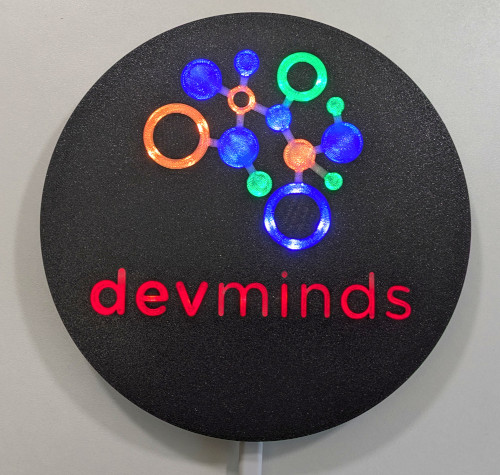

# Embassy Training Project by [devminds GmbH](https://devminds.ch)

This [Embassy](https://embassy.dev) project is used for trainings offered by devminds GmbH.

The project contains an Embassy application to control the **devminds logo lamp**:



The **devminds logo lamp** uses a [Raspberry Pi Pico 2W](https://www.raspberrypi.com/products/raspberry-pi-pico-2/) and interfaces with the following hardware:

* GPIOs
* Status LED
* WS2812 compatible LED strip

This project supports the official [Raspberry Pi Debug Probe](https://www.raspberrypi.com/documentation/microcontrollers/debug-probe.html) for flashing and debugging.


## Getting Started

### Install Rust

As Embassy is based on [Rust](https://rust-lang.org), we first need to set up Rust:

```bash
curl --proto '=https' --tlsv1.2 -sSf https://sh.rustup.rs | sh
```


### Install Rust Target for Pico 2W

Add the required Rust target with **hard FPU** support:

```bash
rustup target add thumbv8m.main-none-eabihf
```


### Install probe-rs

**WARNING:** With `probe-rs` v0.31.0, breakpoints are currently not working in VS Code. See:

* https://github.com/probe-rs/probe-rs/issues/2180

The issue has already been fixed on the `probe-rs` master branch.

**WORKAROUND:** Install `probe-rs` from the master branch:

```bash
cargo install probe-rs-tools --git https://github.com/probe-rs/probe-rs --locked
```

This workaround is already applied when using the provided devcontainer.

---

Install the latest [probe-rs](https://probe.rs/docs/getting-started/installation/) release:

```bash
curl --proto '=https' --tlsv1.2 -LsSf https://github.com/probe-rs/probe-rs/releases/latest/download/probe-rs-tools-installer.sh | sh
```

Install shell completions:

```bash
probe-rs complete install
```

Configure the [probe-rs](https://probe.rs/docs/getting-started/probe-setup/) `udev` rules so that the local user can access the debug probe:

* Download: https://probe.rs/files/69-probe-rs.rules
* Move file to `/etc/udev/rules.d`
* Reload rules:
  ```bash
  sudo udevadm control --reload
  sudo udevadm trigger
  ```


### Check Raspberry Pi Debug Probe Firmware Version

The Raspberry Pi Debug Probe firmware version should be at least 2.3.0.

If the debug probe is connected, check its current version with:

```bash
lsusb -v -d 2e8a:000c | grep bcdDevice
```

If the version is below 2.3.0, follow the Raspberry Pi documentation for [Updating the firmware on the Debug Probe](https://www.raspberrypi.com/documentation/microcontrollers/debug-probe.html#updating-the-firmware-on-the-debug-probe).


## Executing Tests on the Host

The project contains host-testable logic in the library crate (for example, LED strip pattern rendering and state transitions). These tests can be run locally and do not require a Raspberry Pi Pico 2W or a debug probe.

Run the tests with:

```bash
cargo test --lib --target x86_64-unknown-linux-gnu
```

Why `--lib` and a host `--target` are required:

* `src/main.rs` builds the embedded firmware and depends on the `thumbv8m.main-none-eabihf` target.
* The native Linux host tests are implemented in the library crate (`src/lib.rs`), which allows to validate pure application logic locally without flashing the board.


## Further Information

* [Rust: getting started](https://rust-lang.org/learn/get-started)
* [Embassy: getting started](https://embassy.dev/book/#_getting_started)
* [probe-rs: getting started](https://probe.rs/docs/getting-started)
* [Rust on Raspberry Pi: rp235x-project-templates](https://github.com/rp-rs/rp235x-project-template)
* [Embassy on Raspberry Pi: rp235x example](https://github.com/embassy-rs/embassy/tree/main/examples/rp235x)
* [Raspberry Pi Pico PIO for WS2812](https://github.com/embassy-rs/embassy/blob/main/examples/rp/src/bin/pio_ws2812.rs)
